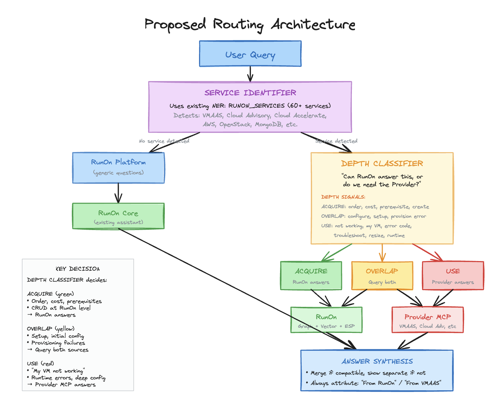
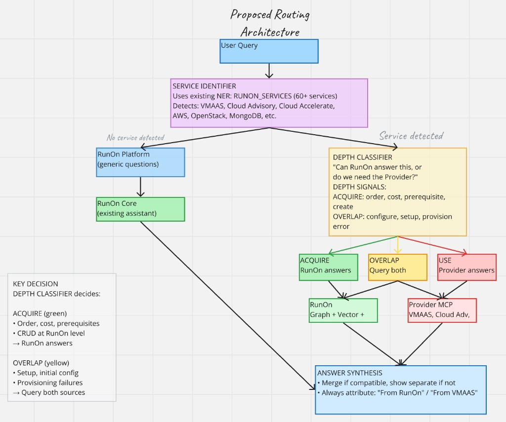
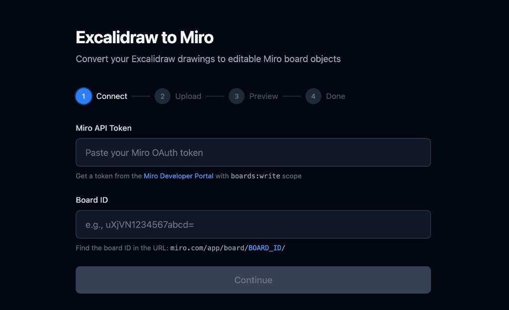
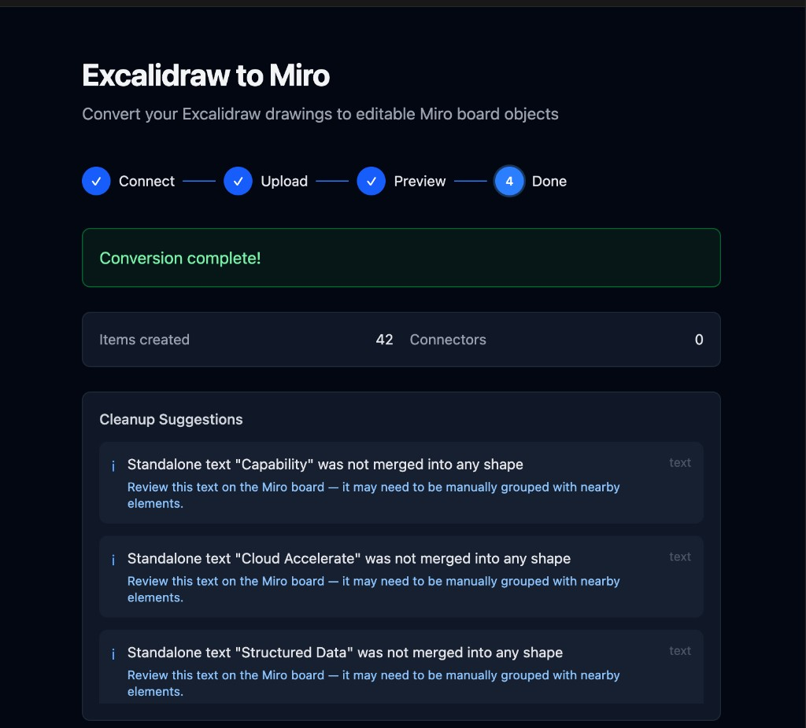
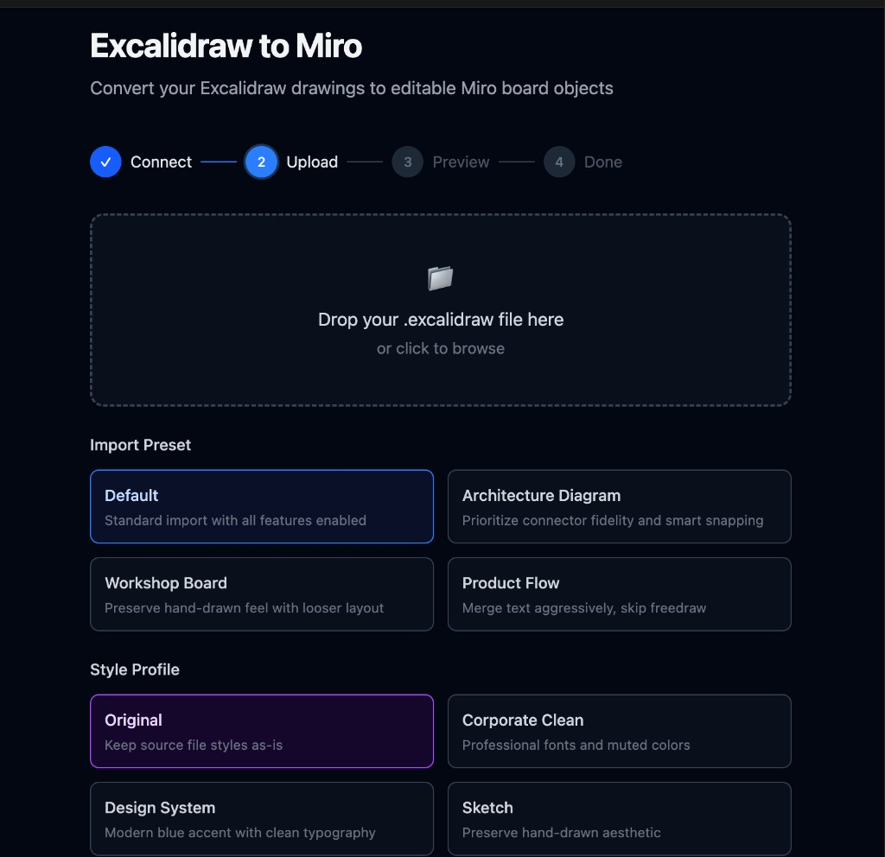

# Excalidraw to Miro Converter

Convert Excalidraw diagrams to editable Miro board objects. Import `.excalidraw` files into Miro with full support for shapes, connectors, text, images, freedraw, and frames — preserving styles, colors, and layout. Available as a CLI tool, Node.js library, and web UI.

> **Looking for an Excalidraw-to-Miro importer?** This is the only tool that converts Excalidraw drawings into native, editable Miro items via the Miro REST API — not screenshots or static images, but real shapes, connectors, and text you can edit on your board.

## Demo

**Excalidraw (input) to Miro (output)**

| Excalidraw | Miro |
|:---:|:---:|
|  |  |

Shapes, colors, text, connectors, and layout are preserved. Text inside shapes is automatically merged into shape content rather than created as separate overlapping items.

**Web UI — Upload, Configure & Convert**

| Web UI - Add MIRO Board| Upload & Configure | Conversion Results |
|:---:|:---:|:---:|
|  |  |  |

Guided 4-step web interface with drag-and-drop upload, import presets, style profiles, and post-conversion cleanup suggestions.

## Why excalidraw-to-miro?

- **Native Miro objects** — Not screenshots. Your Excalidraw shapes, text, and connectors become real, editable Miro items.
- **Full element support** — Rectangles, ellipses, diamonds, arrows, lines, images, freedraw strokes, and frames all convert.
- **Style fidelity** — Colors, fonts, stroke styles, opacity, and fill patterns carry over.
- **Smart layout** — Auto-centering, arrow snapping, table/grid detection, and text-shape merging.
- **Multiple interfaces** — CLI for automation and scripting, web UI for one-off imports, Node.js API for integration.
- **Obsidian compatible** — Import `.excalidraw.md` files directly from your Obsidian vault.

## Features

### Core Conversion
- **Shapes**: Rectangles, ellipses, and diamonds become editable Miro shapes
- **Text**: Standalone text and text bound to shapes
- **Connectors**: Arrows and lines become Miro connectors with proper endpoint binding
- **Images**: Embedded images are extracted and uploaded to Miro
- **Freedraw**: Hand-drawn strokes are converted to SVG and uploaded as images
- **Frames**: Excalidraw frames become Miro frames with children properly attached
- **Groups**: Excalidraw visual groups (`groupIds`) are preserved as native Miro groups, including nested groups
- **Styles**: Stroke colors, fill colors, border styles, and opacity
- **Auto-centering**: Content is automatically centered on the Miro board
- **Smart snapping**: Unbound arrow endpoints snap to nearby shapes
- **Table layout detection**: Wide background shapes (table rows, banners) are kept separate from overlapping text, preserving grid/column layouts

### Web UI
- **Guided 4-step flow**: Connect, Upload, Preview, and Convert with drag-and-drop
- **Import Preview**: See exactly what will be created, skipped, or degraded before writing to Miro
- **Presets**: Architecture Diagram, Workshop Board, and Product Flow import presets
- **Style Profiles**: Apply Corporate Clean, Design System, or Sketch visual overrides
- **Cleanup Suggestions**: Post-conversion actionable feedback for elements that may need manual review
- **Summary Card**: Copy a Markdown summary to share in Slack, Notion, or Jira

### CLI
- **Multiple commands**: `convert`, `preview`, `guided`, `batch`, `repair`
- **Output formats**: Text, Markdown, and JSON output for summaries and previews
- **Interactive guided mode**: Step-by-step wizard with readline prompts for beginners
- **Batch import**: Import multiple `.excalidraw` files from a directory (supports Obsidian vaults)
- **Connector repair**: Interactive flow to re-establish broken connectors from a previous import
- **Smart re-import**: `create`, `update`, and `upsert` modes with persistent ID mapping across runs
- **Style profiles**: Built-in and custom JSON profiles for visual overrides
- **Metadata preservation**: Excalidraw `link` and `customData` fields carry over into Miro item content

## Installation

```bash
npm install
npm run build
```

Or for development:

```bash
npm install
npm run dev -- --help
```

## Prerequisites

### 1. Get a Miro OAuth Token

1. Go to [Miro Developer Portal](https://developers.miro.com/)
2. Create a new app or use an existing one
3. Add the `boards:write` scope
4. Generate an access token

### 2. Get Your Board ID

The board ID is in the URL when viewing a board:
```
https://miro.com/app/board/uXjVN1234567=/
                          ^^^^^^^^^^^^^^^ this is the board ID
```

## Usage

### Web UI

```bash
# Start the API server
npm run dev:server

# In another terminal, start the web UI
npm run dev:web
```

Open `http://localhost:5173` and follow the guided flow:

1. **Connect** — Enter your Miro API token and board ID
2. **Upload** — Drop your `.excalidraw` file and pick an import preset
3. **Preview** — Review what will be created, skipped, or imported with reduced fidelity
4. **Convert** — Run the import and get results with a copyable summary card

For production, `npm run build` compiles everything, then `npm run start:server` serves the API and static frontend together on port 3000.

### CLI

```bash
# Basic conversion
excal2miro convert --in drawing.excalidraw --board uXjVN1234567abcd= --token YOUR_TOKEN

# With options
excal2miro convert \
  --in drawing.excalidraw \
  --board uXjVN1234567abcd= \
  --token YOUR_TOKEN \
  --scale 1.5 \
  --output-format markdown \
  --verbose

# Dry-run preview
excal2miro preview --in drawing.excalidraw

# Interactive guided mode
excal2miro guided

# Batch import from a directory (Obsidian vault support)
excal2miro batch --dir ./vault --board uXjVN1234567abcd= --token YOUR_TOKEN

# Smart re-import (update existing items)
excal2miro convert --in drawing.excalidraw --board uXjVN1234567abcd= \
  --token YOUR_TOKEN --import-mode upsert --mapping-file mapping.json

# Using environment variable for token
export MIRO_TOKEN=YOUR_TOKEN
excal2miro convert --in drawing.excalidraw --board uXjVN1234567abcd=
```

### Options (convert command)

| Option | Description | Default |
|--------|-------------|---------|
| `-i, --in <path>` | Path to Excalidraw file (required) | - |
| `-b, --board <id>` | Miro board ID (required) | - |
| `-t, --token <token>` | Miro OAuth token (or use `MIRO_TOKEN` env) | - |
| `-s, --scale <number>` | Scale factor for coordinates | `1` |
| `--offset-x <number>` | X offset on Miro board | `0` (auto-center) |
| `--offset-y <number>` | Y offset on Miro board | `0` (auto-center) |
| `--snap-threshold <number>` | Distance for snapping arrows to shapes | `50` |
| `--preset <name>` | Use a preset (flowchart, architecture, wireframe, mindmap) | - |
| `--style-profile <path>` | Path to a JSON style profile | - |
| `--import-mode <mode>` | Import mode: `create`, `update`, or `upsert` | `create` |
| `--mapping-file <path>` | Path to ID mapping file for re-imports | - |
| `--output-format <fmt>` | Output format: `text`, `markdown`, or `json` | `text` |
| `--no-connectors` | Skip creating connectors from arrows | `false` |
| `--no-images` | Skip converting embedded images | `false` |
| `--no-freedraw` | Skip converting freedraw to SVG | `false` |
| `--skip-freedraw` | Skip freedraw elements silently | `false` |
| `--no-frames` | Skip converting frames | `false` |
| `-v, --verbose` | Enable verbose logging | `false` |

### Programmatic API

```typescript
import { Converter } from 'excalidraw-to-miro';

const converter = new Converter({
  miroToken: 'YOUR_TOKEN',
  boardId: 'YOUR_BOARD_ID',
  options: {
    scale: 1,
    convertImages: true,
    convertFreedraw: true,
    convertFrames: true,
    verbose: true,
  },
});

const result = await converter.convert('drawing.excalidraw');

console.log(`Items created: ${result.itemsCreated}`);
console.log(`Connectors created: ${result.connectorsCreated}`);
console.log(`Frames created: ${result.framesCreated}`);
console.log(`Images uploaded: ${result.imagesCreated}`);
console.log(`Freedraw converted: ${result.freedrawConverted}`);
```

## Element Mapping

| Excalidraw | Miro |
|------------|------|
| `rectangle` | Shape (rectangle or round_rectangle) |
| `ellipse` | Shape (circle) |
| `diamond` | Shape (rhombus) |
| `text` | Text item (or merged into parent shape) |
| `arrow` | Connector |
| `line` | Connector |
| `freedraw` | Image (SVG conversion) |
| `image` | Image (uploaded from embedded data) |
| `frame` | Frame (with children attached) |
| `groupIds` | Group (via Miro Groups API) |

## Text Handling

Text elements are handled intelligently:

- **Text inside shapes**: If a standalone text element's center falls within a shape's bounds, it is merged into the shape's content rather than created as a separate overlapping text item. Multiple texts in the same shape are joined with line breaks, ordered top-to-bottom.
- **Table layout detection**: Shapes with a wide aspect ratio (> 6:1) are recognized as table rows or background strips. Their overlapping text elements are kept as independent items at their original positions, preserving column/grid layouts.
- **Bound text**: Text with a `containerId` is automatically included in the parent shape (standard Excalidraw binding).
- **Standalone text**: Text that doesn't overlap any shape is created as a separate Miro text item.

### Font Mapping

| Excalidraw | Miro |
|------------|------|
| Virgil (hand-drawn, `1`) | `caveat` |
| Helvetica (`2`) | `arial` |
| Cascadia (code, `3`) | `roboto_mono` |
| Liberation Sans (`4`) | `arial` |

## Image Support

Embedded images in `.excalidraw` files are automatically extracted, decoded from base64, and uploaded to Miro via the image API. Limitations:

- Maximum upload size is 6 MB per image (Miro API limit)
- Images must have `status: "saved"` in the Excalidraw file
- The `scale` property on images is applied to the output dimensions

## Freedraw Conversion

Freedraw (hand-drawn) elements are converted to SVG paths and uploaded as images:

- Points are smoothed using quadratic bezier curves for natural-looking strokes
- Paths with 500+ points are simplified using Douglas-Peucker decimation
- Stroke color, width, style (dashed/dotted), and opacity are preserved
- Use `--no-freedraw` to disable this and skip freedraw elements

## Frame Support

Excalidraw frames are converted to Miro frames:

- Frames are created first, then child items are attached via the Miro API
- Children are identified by their `frameId` property in the Excalidraw data
- Frame title/name is preserved
- Miro frames don't support rotation; rotated frames are created without rotation

**Group support**: Excalidraw `groupIds` (visual selection groups) are converted to native Miro groups via the [Miro Groups API](https://developers.miro.com/reference/creategroup). Nested groups (elements with multiple `groupIds`) are created innermost-first. Groups require at least 2 successfully created items; groups with fewer members are skipped with a cleanup suggestion.

## Connector Behavior

Connectors (arrows/lines) are handled as follows:

1. **Bound arrows**: If an arrow is bound to shapes in Excalidraw, the connector attaches to those Miro items
2. **Unbound arrows**: Endpoints snap to the nearest shape within the snap threshold
3. **Unresolvable arrows**: If either endpoint can't be matched to a shape, the connector is skipped (Miro requires both endpoints to reference board items)
4. **Self-referencing**: Arrows where both endpoints resolve to the same shape are skipped

### Arrowhead Mapping

| Excalidraw | Miro |
|------------|------|
| `arrow` | `arrow` |
| `triangle` | `filled_triangle` |
| `bar` | `stealth` |
| `dot` | `filled_oval` |
| `null` | `none` |

## Conversion Phases

The converter processes elements in a specific order to maintain references:

1. **Phase 0**: Create frames (so children can be attached later)
2. **Phase 1**: Create shapes, text, images, and freedraw SVGs
3. **Phase 1d**: Attach child items to their parent frames
4. **Phase 2**: Create connectors (which reference shapes by Miro ID)
5. **Phase 3**: Create groups from `groupIds` (all items must exist first)

## Coordinate System

- Excalidraw uses top-left origin with Y increasing downward
- Miro uses center-based positioning for shapes
- By default, content is auto-centered at (0, 0) on the Miro board
- Use `--offset-x` and `--offset-y` to position content elsewhere

## Rate Limiting

The converter includes a 100ms delay between API calls to respect Miro's rate limits. For large drawings, the conversion may take some time.

## Development

```bash
# Install dependencies
npm install

# Build
npm run build

# Run in development mode
npm run dev -- --in test.excalidraw --board BOARD_ID --token TOKEN

# Run tests
npm test
```

## Project Structure

```
src/
├── api/                 # Miro API client
│   └── miro-client.ts
├── converter/           # Main conversion orchestrator
│   └── converter.ts
├── mappers/             # Element type mappers
│   ├── shape-mapper.ts
│   ├── text-mapper.ts
│   ├── connector-mapper.ts
│   ├── image-mapper.ts
│   ├── freedraw-mapper.ts
│   ├── frame-mapper.ts
│   ├── style-mapper.ts
│   └── coordinate-transformer.ts
├── parser/              # Excalidraw JSON parser
│   └── excalidraw-parser.ts
├── types/               # TypeScript types
│   ├── excalidraw.ts
│   └── miro.ts
├── server.ts            # Express API server for web UI
├── cli.ts               # CLI entry point
└── index.ts             # Library exports
web/
├── src/
│   ├── App.tsx          # Main React component (4-step guided flow)
│   ├── main.tsx         # React entry point
│   └── index.css        # Tailwind styles
├── index.html           # HTML entry point
└── vite.config.ts       # Vite + Tailwind config
```

## License

MIT
